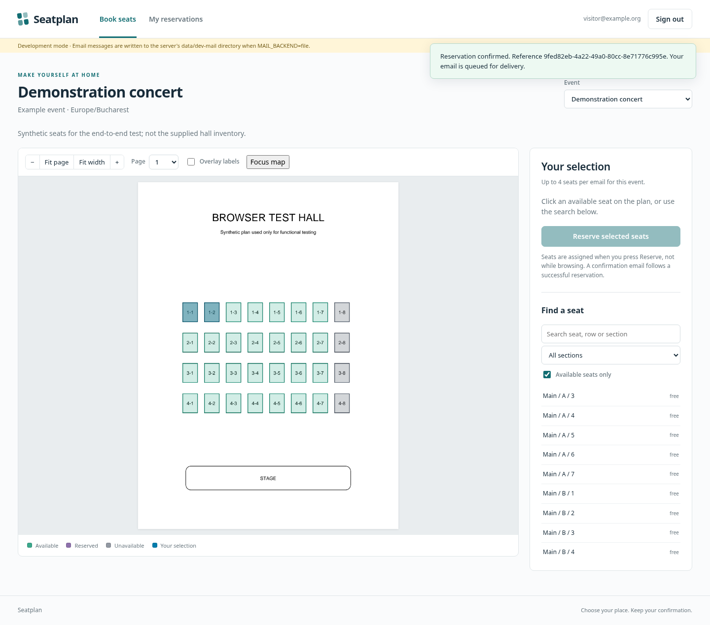

# Seatplan

**Seatplan is a website for reserving specific seats at an event.** An organizer starts with a PDF seating chart, marks the seats that people may book, and publishes the reviewed chart. Visitors open the website, confirm their email address, choose available seats on the map, and receive a reservation confirmation. Organizers can view and change allocations, block seats, and print a seating list.

You run Seatplan on your own server. It is free, open-source software under the MIT license; it is not a hosted booking service. It does not collect payments or issue tickets. Setting it up for public use requires a server, an HTTPS address, and an SMTP email service.



*Visitor booking screen. This image uses a synthetic test hall, not the supplied venue's published seat inventory.*

## How it works

1. **Prepare a plan:** Upload a seating-chart PDF. Draw seats by hand, make a grid, or let the detector suggest shapes. The clickable shapes over the PDF are called the *overlay*.
2. **Review and publish:** Check every seat's position, name, and availability against the original chart. Seatplan does not approve detected seats for you.
3. **Open an event:** Choose a published plan, set the number of seats allowed per email address, and open reservations.
4. **Let visitors book:** Visitors confirm a one-time email link, select seats, and press **Reserve**. Seats are assigned when they press Reserve, so two visitors cannot take the same seat.
5. **Manage the event:** Organizers can change assignments, block seats, export a CSV, and print a plan or private attendee list.

**Start here:** [Deploy with Docker](#quick-start-docker-behind-your-https-proxy) · [Prepare your first event](#preparing-your-first-event) · [Try it locally](#development-without-a-live-smtp-server) · [Read the editor guide](docs/EDITOR.md) · [Translate the interface](docs/TRANSLATIONS.md) · [Run and back up a live installation](docs/OPERATIONS.md)

The application is a standalone implementation. It uses your SMTP server for email and runs its HTTP service behind your HTTPS reverse proxy. The browser does not depend on a third-party CDN or external AI service.

### About the included hall example

The supplied hall PDF and detected seats are an **unpublished review draft**, not a verified seat inventory. Do not open bookings from it until an organizer checks the complete chart, seat labels, and unavailable positions. Automatic detection suggests seats; it cannot establish an authoritative seat count.

Version 1.3 improves recovery of separate shared-edge groups and faint repeated chair symbols. It produces 935 candidate shapes; 59 are marked unavailable after the heuristic and the unchanged 12 manually annotated exclusion masks. All 24 positions checked in the two latest reported regions have separate free targets, including outer-right seats 255–265 and the checked left Loja 9/outer Loja 10 chairs. Those are development-region checks, not a full-hall audit.

See the [original / v1.2 / v1.3 comparison](docs/screenshots/residual-comparison.png), [complete-page editor](docs/screenshots/sample-editor.png), [focused map](docs/screenshots/sample-editor-focus.png), [recovery method and limits](docs/RECOVERY-V1.3.md), and [safe upgrade notes](CHANGELOG.md).

## Included features

| Area | Implementation |
|---|---|
| Visitor access | Passwordless email verification, single-use 15-minute links, persistent sign-in sessions; no registration form or password |
| Reservations | Multiple seats per booking; configurable per-email/event allowance; atomic all-or-nothing allocation; idempotent booking submissions; self-service partial/full cancellation |
| Email | SMTP with STARTTLS, implicit TLS, or a trusted unauthenticated relay; durable queue, retry/backoff, delivery status and manual retry |
| PDF plans | Admin-only PDF uploads; multipage raster rendering; normalized overlay coordinates; immutable published versions; safe replacement workflow |
| Detection | Deterministic line/contour proposals, original-pixel four-border fitting, local cell-consistency checks; optional separate-group and faint-chair recovery; region and scale controls; every candidate requires review |
| Map editor | Click-add; drag-select; move/resize/rotate; drag four corners; exclusions; low-confidence selection; undo; JSON import/export; Fit page / Fit width / Focus map |
| Grid builder | Draw a rectangle or click four skewed outer corners; rows/columns, gaps, numbering, preview and undo; use short strips for curved banks |
| Administration | Create/open/close events; reserve seats for an email or the house; free/block/reassign seats; explicit exception for plan-excluded positions; reason and audit trail |
| Output | Printable allocation map, optional overlay labels, optional attendee roster, CSV export |
| Operations | SQLite online backup utility, health endpoint, worker heartbeat, queue status, Apache/Nginx and systemd examples, Docker Compose |

A selected seat is **not held while someone browses**. Allocation happens when the visitor presses Reserve. Another visitor may book first; the losing request is rejected without partially booking the remaining seats. Email confirmation of sign-in happens **before** booking, rather than temporarily holding seats for an unverified mailbox.

Seatplan supports multiple events at once. Each event has its own seating plan, open/closed state, per-email seat limit, and reservations. Visitors choose an event from the booking page; administrators choose one in **Events & seating**. The browser stops selection at the remaining per-event allowance, while the server still checks the limit when booking. A closed event shows **Not reservable**.

The interface can be translated through [`seatplan/locales/messages.csv`](seatplan/locales/messages.csv). Romanian, German, and Hungarian columns are ready for translation; a language appears in the selector once every cell in its column is filled. See [TRANSLATIONS.md](docs/TRANSLATIONS.md).

## Quick start: Docker behind your HTTPS proxy

Requirements: Docker Engine with Compose, a local persistent disk, your public HTTPS address, an administrator mailbox and a reachable SMTP relay. The supplied Compose configuration binds the HTTP backend to `127.0.0.1:8000` on the host.

```sh
cp .env.example .env
python3 -c 'import secrets; print(secrets.token_urlsafe(48))'
```

Edit `.env`. Paste the generated value into `APP_SECRET`, and supply your real domain, admin email and SMTP configuration:

```dotenv
PUBLIC_URL=https://seats.example.org
APP_SECRET=PASTE_A_LONG_RANDOM_SECRET_HERE
ADMIN_EMAILS=alex@example.org,second-admin@example.org
DEVELOPMENT=0
MAIL_BACKEND=smtp
MAIL_FROM="Seat reservations <seats@example.org>"
SMTP_HOST=mail.example.org
SMTP_PORT=587
SMTP_SECURITY=starttls
SMTP_USER=seats@example.org
SMTP_PASSWORD=YOUR_SMTP_PASSWORD
TRUSTED_PROXY_CIDRS=
```

Protect the file and start **both** services:

```sh
chmod 600 .env
docker compose up -d --build
docker compose logs --tail=100 web worker
```

Install the relevant rules from `deploy/apache.conf` inside your existing SSL virtual host, or adapt `deploy/nginx.conf`. Visit the external HTTPS address, request a sign-in link using an email listed in `ADMIN_EMAILS`, and open it. The page signs you in automatically. Administration is then visible. Administrators use the same email flow; no hard-coded administrator password exists.

To load the supplied PDF, detection candidates and hand-marked exclusion areas:

```sh
docker compose exec web python -m seatplan.cli seed-sample
```

This does **not** publish the plan or create an open event. Repeating the command leaves an existing import of the same PDF unchanged. After upgrading an existing installation, use `python -m seatplan.cli seed-sample --new` to create a separate current-version draft without touching existing plans or bookings. Alternatively, upload `examples/sample-hall.pdf` through the web UI and run detection there. The sample exclusion profile is applied only when the uploaded PDF's SHA-256 matches the supplied sample exactly.

### HTTP upstream, HTTPS outside

`PUBLIC_URL` is the external address used for email links, browser routes, cookie security and allowed request origins. The application itself listens on **plain HTTP**. There is no backend HTTP-to-HTTPS redirect loop. Secure cookies are enabled because the configured public address is HTTPS, not because the upstream connection is encrypted.

Uvicorn runs with `--no-proxy-headers`. The app does not infer public URLs from client-controlled forwarded headers. For IP-based throttling, optionally configure the **exact proxy peer address/network as seen by the application** in `TRUSTED_PROXY_CIDRS`; that proxy must overwrite `X-Real-IP`. In Docker this peer may be the bridge gateway, not `127.0.0.1`. Do not trust all addresses. With no trusted proxy configured, requests behind one proxy share an IP throttling bucket; configure this before public launch.

For a subpath, use `PUBLIC_URL=https://faculty.example.org/seats` and the prefix-preserving `/seats/` rules in the proxy example. Do not include a trailing slash in `PUBLIC_URL`. The proxy should redirect `/seats` to `/seats/`. Cookies and static/API/mail links use that path.

For a remote proxy, replace the loopback binding with a private interface binding and firewall access to the proxy host. Plain HTTP should remain on a trusted private transport.

## Preparing your first event

Open **Administration → Seat plans** and upload the PDF. Keep the worker running: it rasterizes the PDF and later handles detection jobs. Select a page, then either detect candidate shapes, draw grids, or add seats manually.

The detector is a starting point, not a seat-count oracle. See [the v2 changes and measured limitations](docs/DETECTION-V2.md). The Multi-pass method is the default; the Legacy method reproduces the original detector. Use a small **Detection region** and tune side lengths for different portions of a hall. Preview candidates, add non-overlapping shapes, or explicitly replace the current page's shapes. Nothing is approved automatically.

Review each section and row against the source. Assign meaningful section/row/seat identities, remove false positives, reconstruct missing boxes, and exclude crossed-out positions. Seat numbers may repeat in different sections or rows; the complete identity is **section + row + label**. Case-insensitive duplicates inside a plan are rejected. Click or drag to select multiple seats; use the inspector and renumber tool. For the supplied scan, automatic `D0001`-style labels are provisional and must be corrected.

**Exclude area** creates a persistent non-reservable rectangular mask. A seat whose center is inside a mask stays excluded even when its individual flag is set to Free. Polygon masks are supported by the overlay format; imported sample masks include polygons. Remove a mask separately when deliberately changing that rule. A crossed-out seat can also be individually marked Excluded, or omitted entirely from the overlay. Approved excluded shapes may remain visible but are not publicly reservable.

Once all candidates are reviewed, **Save draft → Publish**. Publication is rejected while any candidate is unreviewed. In **Events & seating**, create an event using that published plan, choose the per-email allowance (`0` means unlimited), and set reservations to Open. The event's date/time field is display text; it does not automatically open or close the event.

See [the editor guide](docs/EDITOR.md) for spacing, rotation, uneven rows, numbering and PDF replacement.

## Changing a PDF or seating arrangement

Published plans are immutable. Duplicate a plan to change the overlay on its existing background, or upload a new PDF to create a different draft. Export/import the old overlay when helpful; importing it marks every seat unreviewed, and importing against a different PDF requires an alignment warning acknowledgment. Normalized coordinates do not make different layouts geometrically equivalent.

Publish the reviewed replacement, then edit the event and explicitly select it. Active reservations and event-level blocks are mapped only through identical **section / row / label** values. Missing occupied seats, or a reserved seat that becomes excluded, prevent migration. Resolve affected assignments deliberately first; the app never silently drops reservations. Existing events keep the original plan until switched. Event-information/plan changes enqueue notices to affected reservation email addresses.

## Administrator allocation overrides

In **Events & seating**, select seats on the map or roster and choose Free, Blocked, or Reserved. An optional email assigns the reservation to that mailbox; blank email means a house reservation. A reason is required. Existing owners receive change notifications. Stale event revisions are rejected, so refresh before applying an override after other bookings changed the event.

Free removes an event allocation, but does not erase a permanent plan exclusion. To reserve an excluded position despite that exclusion, the administrator must explicitly check **allow reserving plan-excluded seats**. To make it generally available to visitors, remove the exclusion in a new reviewed plan version. Ordinary visitors cannot bypass these rules.

Print the seating snapshot with or without the private attendee list. The print page supports optional overlay labels for manually numbered seats. Use the browser's Print / Save as PDF command, A4 portrait and background graphics. CSV and rosters are administrator-only and contain personal data; store them accordingly.

## Development without a live SMTP server

Python 3.12+ is the deployment target; the delivered tests ran on Python 3.13.5. The runtime dependencies are pinned to the exercised versions.

```sh
python3 -m venv .venv
. .venv/bin/activate
pip install -r requirements.txt
export DEVELOPMENT=1 MAIL_BACKEND=file
export PUBLIC_URL=http://localhost:8000
export ADMIN_EMAILS=admin@example.org
export APP_SECRET="$(python -c 'import secrets; print(secrets.token_urlsafe(48))')"
export DATA_DIR="$PWD/data"
python -m seatplan.cli init
python -m seatplan.cli seed-sample
python -m uvicorn seatplan.app:create_app --factory --host 127.0.0.1 --port 8000 --no-proxy-headers
```

In a second terminal, activate the same virtual environment, export the same settings, then run `python -m seatplan.worker`. Development emails appear as `.eml` files in `data/dev-mail`; open the link in the newest matching message. This folder is not served by the app. File delivery and public HTTP URLs are rejected in production mode.

Native systemd deployment is documented in [DEPLOYMENT.md](docs/DEPLOYMENT.md).

## Tests and verification

```sh
pip install -r requirements-dev.txt
python -m pytest -q
# Requires an installed Chromium browser; override CHROMIUM_EXECUTABLE when needed.
python tests/browser_smoke.py --output /tmp/seatplan-browser
```

The delivered automated suite passes **132 tests**, including SMTP transmission to a loopback test server, PDF rendering, deterministic sample detection, geometry validation, review gates, CSRF/authentication, cancellation, migration and a 20-way simultaneous booking race with exactly one successful allocation.

UI verification exercised Chromium through an **offline DOM / HTTP API bridge**, because this environment's managed browser blocks all URL navigation. The real HTTP app and worker handled those API operations; the browser rendered and exercised the controls, but the bridge supplied request origin/cookies and assets. This is not a complete normal-browser deployment test. The normal browser runner is included for use on your server; the bridge mode is `--bridge`. The report records 16 passing UI checks, including actual clicks on the 17 earlier and 24 new reference positions, with no uncaught JavaScript errors. The print scenario uses a separate synthetic hall; it does not publish the supplied venue. Geometry/API tests also verify polygon booking and polygon print markup.

See [TESTING.md](docs/TESTING.md), `docs/test-results.xml` and `docs/browser-report.json`. Docker image build, your SMTP authentication/TLS configuration, your real proxy, and live Internet operation were not exercised here. Before launch, test those paths in staging, review dependencies/security updates, and complete the seat inventory review. This is not a security-audit certification or a claim of exhaustive PDF detection accuracy.

## Structure and operational boundaries

The app uses FastAPI, server-rendered page shells, local JavaScript modules/SVG, SQLite WAL and a separate email/PDF worker. No Redis, PostgreSQL or Node build is needed. Multiple web processes may share the **same local SQLite file** on one host. Do not place it on NFS or run this release as a multi-host clustered service. For high-scale deployments, migrate the transaction/storage design deliberately rather than copying the volume to multiple nodes.

Defaults: 20 MB/PDF, 10 pages/PDF, 5,000 shapes/plan, 100 seats/public booking request, 1,000 seats/admin override request. PDF jobs run in a time/resource-limited subprocess; only administrators can upload. This is not a full hostile-document sandbox. Treat admin-uploaded PDFs as trusted and keep the parser dependencies patched.

The UI does not provide payment, QR ticket scanning, waitlists, SSO, CAPTCHA, automatic event scheduling, automatic radial/arc grid generation, scanned-number OCR, or automatic semantic section recognition. Curved banks are handled with short four-corner grids and individual corner adjustments. An email allowance is per mailbox, not per human; it cannot stop someone with multiple mailboxes.

Use [OPERATIONS.md](docs/OPERATIONS.md) for backup/restore, mail failures, retention and launch checks. Original source code is MIT-licensed; dependencies retain their licenses. The supplied hall PDF is included as a user-provided test fixture, not relicensed as MIT.


## Reproduce the detection comparisons

```sh
# Current residual-seat recovery: v1.2 versus v1.3
python tools/audit_recovery.py --output /tmp/seatplan-recovery-audit
# Historical four-corner geometry comparison: v1.1 versus v1.2
python tools/audit_sample.py --output /tmp/seatplan-audit
```

The recovery audit reruns both v1.2 and v1.3 on the supplied PDF, compares the 24 new reference positions, verifies unique rather than merged targets, checks the earlier 24 polygons, and writes original/old/new crops. The historical geometry audit explicitly disables v1.3 recovery so its labels remain accurate. All references were used during development, not held-out validation. The earlier mean polygon IoU of 0.917 is unchanged on the same 24 cells and is not a full-hall accuracy score. See `docs/recovery-audit.json`, `docs/geometry-audit.json`, and `docs/RECOVERY-V1.3.md`.
